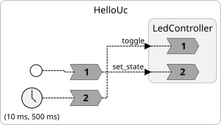

# reactor-uc unofficial DATE26 tutorial

| RIOT-OS | Adafruit Feather Sense |
|------------------|-------------------|
|  |  |

- **Git:** <https://github.com/riot-os/RIOT>
- **Supported Boards:** <https://www.riot-os.org/boards.html>
- **Documentation:** <https://doc.riot-os.org/>
- **Adafruit page:** <https://learn.adafruit.com/adafruit-feather-sense>
- **RIOT docs for board:** <https://api.riot-os.org/group__boards__adafruit-feather-nrf52840-sense.html>

______

This is a tutorial for Lingua Franca applications running on RIOT OS with the [Adafruit Feather Sense](https://learn.adafruit.com/adafruit-feather-sense) board. It uses [reactor-uc](https://github.com/lf-lang/reactor-uc), the "micro C" target for Lingua Franca.

## 1. Prerequisites

### Supported Operating Systems

| OS | Support Level |
|----|---------------|
| **Linux** (Ubuntu/Debian) | Fully supported (recommended) |
| **NixOS / Nix** | Fully supported |
| **macOS** | Supported with caveats |

> **Note:** For detailed RIOT OS setup instructions, see the official [RIOT Getting Started Guide](https://doc.riot-os.org/getting-started.html).

---

### 1. Clone reactor-uc and this tutorial


```bash
# Clone via HTTPS
git clone https://github.com/lf-lang/reactor-uc.git --recurse-submodules

# Or clone via SSH
git clone git@github.com:lf-lang/reactor-uc.git --recurse-submodules

# Set the environment variable (add to ~/.bashrc for persistence)
export REACTOR_UC_PATH=$(pwd)/reactor-uc
```


### 1.1. Linux (Ubuntu / Debian)

Most RIOT OS developers use Linux, providing the most streamlined experience. Ubuntu is recommended for newcomers.

**Install required packages:**

```bash
sudo apt update
sudo apt install git openjdk-17-jdk openjdk-17-jre cmake build-essential \
    python3 python3-serial gcc-arm-none-eabi gdb-multiarch openocd
```

### 1.2. NixOS / Nix Package Manager

This is the easiest setup method. The repository includes a `shell.nix` / `flake.nix` that provisions all dependencies automatically.

**If you don't have Nix installed:**

```bash
curl -L https://nixos.org/nix/install | sh
```

Otherwise use your package manager to install it.

**Enter the development environment:**

```bash
nix develop
```

This creates a shell with all dependencies (cross-compiler, Java, etc.) pre-installed. No manual package installation required.

> **Important:** Run `nix develop` each time you open a new terminal session for this project.

### 1.3. macOS

Native macOS development is supported but requires additional setup. macOS ships with an older version of `make`, so you must install GNU Make 4.0+.

**Install required packages via Homebrew:**

```bash
brew install git cmake openjdk@17 make
pip3 install pyserial
```

**Install the ARM cross-compiler:**

```bash
brew install --cask gcc-arm-embedded
```

> **Warning:** Do not install the `arm-none-eabi-gcc` formula. If you did, uninstall it first:
> ```bash
> brew uninstall arm-none-eabi-gcc
> brew install --cask gcc-arm-embedded
> ```

> **Important:** On macOS, `make` is installed as `gmake`. Use `gmake` instead of `make` in all commands below.

---

### 1.4. Verify Your Setup

Check that the required tools are available:

```bash
# Check cross-compiler
which arm-none-eabi-gcc

# Check Java version (should be 17+)
java -version

# Check make version (should be 4.0+)
make --version   # or gmake --version on macOS
```

## 2. Start Using this Repository


The RIOT OS sources are provided as a submodule of the new repository, to fetch them do:

```bash
cd reactor-uc-tutorial
git submodule update --init --recursive
```

## 3. Configure the Makefile

The repository has a `Makefile` that governs the build. By default, it compiles the LF program in `src/HelloUc.lf`. To compile a different program, edit the `Makefile` to set `LF_MAIN` to your program and `BOARD` to your board. 

```Makefile
LF_MAIN ?= HelloUc
BOARD ?= adafruit-feather-nrf52840-sense
```

Alternatively, you can override the board on the command line. For example:

```sh
make LF_MAIN=HelloUc all
```

## 4. LedController Reactor

Modify `src/LedController.lf` — a reactor that controls the on-board LED.

> **Lingua Franca docs:** [lf-lang.org/docs](https://www.lf-lang.org/docs/)

### Task

Finish the `LedController` reactor by adding an input port `toggle` that triggers an reaction that toggles the on-board led.

Use the RIOT macros from `led.h`: `LED0_TOGGLE` and `LED1_TOGGLE`

---

## 5. HelloUc: Using the LedController

Edit `src/HelloUc.lf` to use your `LedController` with a periodic timer.

You can import reactor from other files like this:

```
import LedController from "./LedController.lf"
```

### Task

1. Import `LedController` from `./LedController.lf`
2. Instantiate it as `led`
3. Add a timer `t` with 10ms offset and 500ms period
4. Add a `startup` reaction that sets the LED on initially
5. Add a timer reaction that toggles the LED

```lf
target uC

import LedController from "./LedController.lf"

main reactor {
  // TODO: instantiate led, add timer, add reactions
}
```

## 6. Build

```bash
make all
```

Or override the Makefile configuration with parameters:

```bash
make LF_MAIN=HelloUc BOARD=adafruit-feather-nrf52840-sense all
```

## 7. Flash the Program onto Your Board


```bash
make flash
```

Or override the Makefile configuration with parameters:

```bash
make LF_MAIN=HelloUc BOARD=adafruit-feather-nrf52840-sense flash
```
| Flashing Procedure | LF Diagram |
|--------------------| ------------ |
| | 

## 8. Open a Terminal

You can open a terminal that interacts with stdin and stdout of your program as follows:

```bash
make term
```

This will display any output your program generates using, for example, `printf`.

You can also get debug output from the `reactor-uc` runtime by changing the following line in the `Makefile`:

```
CFLAGS += -DLF_LOG_LEVEL_ALL=LF_LOG_LEVEL_ERROR
```

to

```
CFLAGS += -DLF_LOG_LEVEL_ALL=LF_LOG_LEVEL_DEBUG
```


## 9. Sensor Makefile Configuration

Add the following lines to your Makefile to enable I2C support in RIOT:

```Makefile
# so i2c and printf support for floats is compiled into the riot kernel
USEMODULE += periph_i2c 
USEMODULE += printf_float
```

## 10. Implementing the Sensor

The Adafruit Feather Sense includes many sensors. We'll focus on the [LSM6DS33](https://www.pololu.com/file/0J1087/LSM6DS33.pdf) accelerometer and gyro. See the [full sensor list](https://learn.adafruit.com/adafruit-feather-sense) for details.

The file `LSM6DS33.lf` has a section for reading sensor values that you need to complete. Refer to the [RIOT I2C documentation](https://api.riot-os.org/group__drivers__periph__i2c.html) and read register `OUTX_L_G` (see the datasheet for details).

To test your sensor implementation, compile and run `Sensor.lf` (which includes the sensor reactor). This command compiles, flashes, and opens the serial console:


```bash
make LF_MAIN=Sensor BOARD=adafruit-feather-nrf52840-sense all flash term
```


## 11. Using Sensor Values

Make the LED blink faster or slower based on the device's orientation. When flat on a table (angle ≈ 0), use a 1-second LED toggle period. 

```
OFFSET = 4 * PI ~ 12.566
ORIENTATION_TO_TIME = 4 * PI * 1000 ~ 12566
PERIOD = ORIENTATION_TO_TIME / (current_angle + OFFSET)
```

This produces our `PERIOD` in milliseconds.


Flash the program and rotate the device around its longest axis to see the LED blink rate change.

## 12. Annotations

reactor-uc supports many annotations; see the [full list](http://micro-lf.org/documentation/annotations/). In this scenario, we'll add a `timeout` and configure a buffer size for actions.

- **Timeout:** add the `@timeout(<time_value>)` annotation to the main reactor.
- **Action Buffer Size:** add the `@max_pending_event(<number>)` before the action declaration.

Now recompile your program.

You can validate if the code generator correctly adjusted the action buffer size by opening `src-gen/Sensor/Sensor/Sensor.h` file and searching for the `LF_DEFINE_ACTION_STRUCT` macro.

The timeout property can be found inside the `src-gen/Sensor/lf_start.c` file inside the `DynamicScheduler_ctor`.


## 13. Delayed Connections and the Buffer Annotation

Before we go federated it is good to look into the `@buffer` annotation, which can be added to delayed connections to increase the associated buffer for storing the values. If you have a timer with a high frequency it is very easy to run out of space inside the connection.

Compile the `src/DelayedConn.lf` program and see when it stops dropping values, by changing the `@buffer` annotation.

## 14. The Link Local Address of the Device

Temporarily add the following to your Makefile:

```
USEMODULE += gnrc_netif
USEMODULE += gnrc_ipv6_default
USEMODULE += ipv6_addr
USEMODULE += netdev_default
USEMODULE += gnrc_netif_ieee802154
USEMODULE += gnrc_ipv6_default
USEMODULE += auto_init_gnrc_netif
USEMODULE += auto_init
```

Then compile and run the `src/Ipv6LinkLocal.lf` program. This program will print the IPv6 Link Local address of this board. Copy and save this address.


## 15. Going Federated

You need to tell reactor-uc to add the COAP network channel to the compilation unit:

```Makefile
CFLAGS += -DNETWORK_CHANNEL_COAP_RIOT
```

In reactor-uc, configure the network channels by adding annotations:

```
@interface_coap(name="if1", address="<Paste Your Link Local Address Here>")
```

Coordinate with your neighbor, agree on which federate your board will run, and exchange the IPv6 link local addresses accordingly. Also, make sure your programs have the same structure.

This creates a CoAP network channel named `if1` with the specified IPv6 address. The `@link` annotation specifies which network channel interface to use for a connection.

The compilation command also changes because you now need to specify which federate to compile and flash using the `LF_FED` variable:

```bash
make LF_MAIN=SimpleCoapFederated LF_FED=r1 BOARD=adafruit-feather-nrf52840-sense all flash term

make LF_MAIN=SimpleCoapFederated LF_FED=r2 BOARD=adafruit-feather-nrf52840-sense all flash term
```

If successful, you should see in the serial output that the two federates are communicating.

## 16. The Final Boss - Federated Blinking


You made it to the final level.

Open the the `src/FederatedBlinking.lf` file now we want to combine everything learned and
here we want to let the local Blink faster if neighbors microcontroller is turned.

The make sure all the necessary Modules are added inside your `Makefile` additionally make sure you flash the correct verion onto the correct board (otherwise the addresses dont match). 


